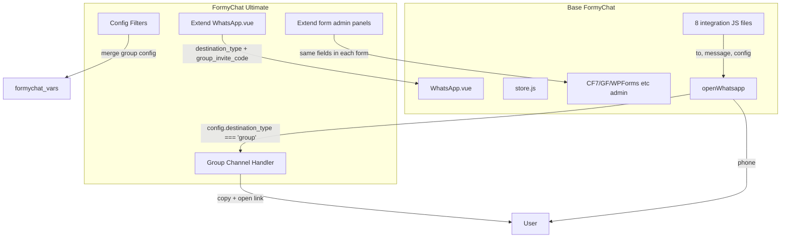
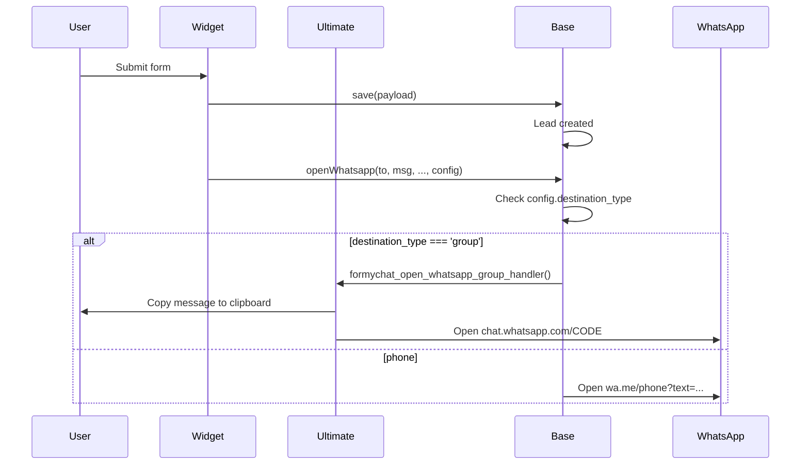

# WhatsApp Group Messaging Implementation Plan (Option B)

## Context from Competitor Analysis

- **Cresta WhatsApp Chat**: Single group ID, `https://chat.whatsapp.com/{id}`
- **WP WhatsApp**: Auto-detects group via `chat.whatsapp.com` in URL
- **WP WhatsApp Chat**: Explicit `type` (phone/group), parses group URL, mobile vs desktop URLs

**WhatsApp limitation**: Group invite links (`https://chat.whatsapp.com/{code}`) do NOT support pre-filled message. Flow for form submissions: **copy message to clipboard + open group link**.

---

## Form Integrations Scope (All 8)


| #   | Form               | Config Storage                        | Frontend Config Source                         | Standalone | In Widget |
| --- | ------------------ | ------------------------------------- | ---------------------------------------------- | ---------- | --------- |
| 1   | **FormyChat**      | Widget `config.whatsapp`              | `formychat_vars.data.widgets`                  | N/A        | Yes       |
| 2   | **Contact Form 7** | `_formy_chat_configuration` post meta | `wpcf7submit` response.formychat               | Yes        | Yes       |
| 3   | **Gravity Forms**  | `gform_get_meta` (formychat_*)        | AJAX / inline script                           | Yes        | Yes       |
| 4   | **WP Forms**       | `form_data.settings.formychat`_*      | `wpformsAjaxSubmitSuccess` json.data.formychat | Yes        | Yes       |
| 5   | **Fluent Forms**   | `Helper::getFormMeta` (formychat_*)   | `fluentform_submission_success` response       | Yes        | Yes       |
| 6   | **Forminator**     | Widget only                           | `formychat_vars.data.widgets`                  | No         | Yes       |
| 7   | **Formidable**     | Form options (formychat_*)            | AJAX / inline script                           | Yes        | Yes       |
| 8   | **Ninja Forms**    | Action settings (formychat_*)         | `nfFormSubmitResponse` actions.formychat       | Yes        | Yes       |


---

## Architecture Overview




---

## Part 1: Minimal Base Plugin Changes

Required extension points so Ultimate can intercept the WhatsApp flow without duplicating logic.

### 1.1 Extend `openWhatsapp` in [formychat/src/frontend/store.js](wp-content/plugins/formychat/src/frontend/store.js)

- Add optional 5th parameter: `config` (object)
- At start of function, add handler check:

```javascript
// If group destination and Ultimate handler exists, delegate
if (config?.destination_type === 'group' && typeof window.formychat_open_whatsapp_group_handler === 'function') {
    return window.formychat_open_whatsapp_group_handler(to, text, isWeb, newTab, config);
}
```

### 1.2 Pass config to `openWhatsapp` at all call sites

Update every `openWhatsapp(...)` call to pass the whatsapp config as 5th argument:


| File                                                                                     | Form       | Config source                                        | Call count |
| ---------------------------------------------------------------------------------------- | ---------- | ---------------------------------------------------- | ---------- |
| [Widget.vue](wp-content/plugins/formychat/src/frontend/Widget.vue)                       | FormyChat  | `whatsapp` (widget config)                           | 4          |
| [cf7.js](wp-content/plugins/formychat/src/frontend/integration/cf7.js)                   | CF7        | `widgetObject.config.whatsapp` or `settings`         | 2          |
| [gravityforms.js](wp-content/plugins/formychat/src/frontend/integration/gravityforms.js) | Gravity    | `widgetObject.config.whatsapp` or `settings`         | 2          |
| [wpforms.js](wp-content/plugins/formychat/src/frontend/integration/wpforms.js)           | WP Forms   | `widgetObject.config.whatsapp` or `settings`         | 2          |
| [fluentform.js](wp-content/plugins/formychat/src/frontend/integration/fluentform.js)     | Fluent     | `widgetObject.config.whatsapp` or `settings`         | 2          |
| [ninjaforms.js](wp-content/plugins/formychat/src/frontend/integration/ninjaforms.js)     | Ninja      | `widgetObject.config.whatsapp` or `settings`         | 2          |
| [formidable.js](wp-content/plugins/formychat/src/frontend/integration/formidable.js)     | Formidable | `widgetObject.config.whatsapp` or `result.formychat` | 4          |
| [forminator.js](wp-content/plugins/formychat/src/frontend/integration/forminator.js)     | Forminator | `widgetObject.config.whatsapp` (widget only)         | 1          |


Pattern: `openWhatsapp(to, message, isWeb, newTab, whatsappConfig)` where `whatsappConfig` is the full `whatsapp` object from widget config or form settings.

### 1.3 Extend default widget config in [class-app.php](wp-content/plugins/formychat/includes/core/class-app.php)

Add to `widget_config()['whatsapp']` (or via existing `formychat_widget_configuration` filter from Ultimate):

```php
'destination_type' => 'phone',  // 'phone' | 'group'
'group_invite_code' => '',
```

Base can add these with defaults; Ultimate will allow editing when premium.

---

## Part 2: FormyChat Ultimate Implementation

### 2.1 New PHP Class: `WhatsApp_Group`

**Path**: `formychat-ultimate/includes/classes/class-whatsapp-group.php`

**Responsibilities**:

- Register filters and actions
- Filter `formychat_widget_configuration` to add `destination_type`, `group_invite_code` defaults
- Filter `formychat_vars` to merge group config into each widget's `config.whatsapp` (when stored separately; otherwise widget save handles it)
- Per-form filters to inject group config into frontend data: `formychat_cf7_posted_data`, Gravity frontend output, WP Forms frontend, Fluent frontend, Formidable frontend, Ninja `process()` output
- Enqueue frontend script for group handler

**Config storage**: Group config lives in the same place as phone config – widget `config.whatsapp` and each form's existing meta/options. No separate options page.

### 2.2 Admin UI: Extend Existing Settings (No New Submenu)

**Principle**: Add destination type (Phone / Group) and group invite code to the **existing WhatsApp Number settings** in each context. Form selection already exists in [Customize.vue](wp-content/plugins/formychat/src/admin/views/edit-widget/Customize.vue) ("Choose the source through which you want to send message to WhatsApp" + form dropdowns) – no additional UI for form selection.

**Widget edit flow** ([Main.vue](wp-content/plugins/formychat/src/admin/views/edit-widget/Main.vue) → tabs: WhatsApp, Triggers, Customize, Greetings):

- **WhatsApp tab** ([WhatsApp.vue](wp-content/plugins/formychat/src/admin/views/edit-widget/WhatsApp.vue)): Extend the "WhatsApp Number" section (lines 117–138). Add:
  - **Destination type** radio/toggle: "Phone" | "Group" (ProBadge when Group, locked if !is_premium)
  - When **Phone**: show existing country code + number fields
  - When **Group**: show group invite link input (accept full URL or code; auto-parse `chat.whatsapp.com/XXX`)
- **Customize tab**: No changes – form selection (FormyChat, CF7, Gravity, WP Forms, etc.) and form dropdown already exist
- **Save**: Widget config is saved via existing REST; `destination_type` and `group_invite_code` stored in `config.whatsapp`

**Third-party form admin** (standalone forms): Extend each form's existing FormyChat settings section (where WhatsApp number is configured) with the same destination type + group invite code.

### 2.3 Per-Form Integration (All 8 Forms)

#### 1. FormyChat / Widget

- **Location**: [WhatsApp.vue](wp-content/plugins/formychat/src/admin/views/edit-widget/WhatsApp.vue) – extend "Single WhatsApp Number" block
- **Config**: `widget.config.whatsapp.destination_type`, `widget.config.whatsapp.group_invite_code`
- **UI**: Add destination type toggle + group invite input; gate with `isLocked` (ProBadge)

#### 2. Contact Form 7

- **Location**: [class-cf7-admin.php](wp-content/plugins/formychat/includes/forms/contact-form/class-cf7-admin.php) – extend FormyChat tab table (after "WhatsApp Number" row ~141)
- **Storage**: `_formy_chat_configuration` post meta
- **UI**: Add destination type radio + group invite input in same table; Ultimate adds via `formychat_cf7_panels` or filter-injected HTML
- **Save**: Hook `wpcf7_save_contact_form` (priority 20) to merge `destination_type`, `group_invite_code`
- **Frontend**: Filter `formychat_cf7_posted_data`

#### 3. Gravity Forms

- **Location**: FormyChat settings tab in GF form editor
- **Storage**: `gform_get_meta` / `gform_update_meta`
- **UI**: Add destination type + group invite fields next to phone number in existing FormyChat fields
- **Frontend**: Extend formychat array in [class-gf-frontend.php](wp-content/plugins/formychat/includes/forms/gravity-forms/class-gf-frontend.php)

#### 4. WP Forms

- **Location**: FormyChat section in WP Forms builder (`formychat_wpforms_settings_before_html` / `formychat_wpforms_settings_after_html`)
- **Storage**: `form_data.settings`
- **UI**: Add destination type + group invite fields beside phone fields
- **Frontend**: [class-wpforms-frontend.php](wp-content/plugins/formychat/includes/forms/wpforms/class-wpforms-frontend.php)

#### 5. Fluent Forms

- **Location**: FormyChat tab in Fluent Forms settings
- **Storage**: `Helper::getFormMeta` / `Helper::updateFormMeta`
- **UI**: Add destination type + group invite fields in existing FormyChat tab
- **Frontend**: [class-fluentform-frontend.php](wp-content/plugins/formychat/includes/forms/fluentform/class-fluentform-frontend.php)

#### 6. Forminator

- **Location**: Widget only – uses [WhatsApp.vue](wp-content/plugins/formychat/src/admin/views/edit-widget/WhatsApp.vue) when form is in widget
- **Standalone**: N/A (no FormyChat settings for Forminator standalone)

#### 7. Formidable

- **Location**: FormyChat tab in Formidable form settings
- **Storage**: Form options
- **UI**: Add destination type + group invite fields in [class-formidable-admin.php](wp-content/plugins/formychat/includes/forms/formidable/class-formidable-admin.php) render
- **Frontend**: [class-formidable-frontend.php](wp-content/plugins/formychat/includes/forms/formidable/class-formidable-frontend.php)

#### 8. Ninja Forms

- **Location**: WhatsApp (FormyChat) action settings in Ninja Forms
- **Storage**: Action settings in [class-ninjaforms-admin.php](wp-content/plugins/formychat/includes/forms/ninjaforms/class-ninjaforms-admin.php)
- **UI**: Add `formychat_destination_type`, `formychat_group_invite_code` to `_settings`; extend `process()` output
- **Frontend**: [ninjaforms.js](wp-content/plugins/formychat/src/frontend/integration/ninjaforms.js)

### 2.4 Frontend JavaScript: Group Channel Handler

**Path**: `formychat-ultimate/public/js/whatsapp-group.js`

**Logic**:

```javascript
window.formychat_open_whatsapp_group_handler = function(to, text, isWeb, newTab, config) {
    const code = config?.group_invite_code || extractFromUrl(to);
    if (!code) return false; // fallback to default
    const url = 'https://chat.whatsapp.com/' + code;
    if (text) {
        navigator.clipboard.writeText(text).catch(() => {});
        // Optional: show "Message copied" toast
    }
    if (newTab && !isSafari()) {
        const w = window.open('about:blank', '_blank');
        if (w) { w.opener = null; w.location.href = url; }
    } else {
        window.open(url, '_top');
    }
    return true; // handled
};
```

- `extractFromUrl`: Parse `chat.whatsapp.com/XXX` or full URL to get invite code
- Enqueue with `formychat-frontend` as dependency, load only when `formychat_vars.is_premium` (can check in PHP before enqueue)

### 2.5 Widget Form URL (iframe) for embedded forms

When a form (CF7, Gravity, WP Forms, Fluent, Formidable, Forminator, Ninja) is embedded in a widget and destination is group, the iframe URL in [Widget.vue form_url](wp-content/plugins/formychat/src/frontend/Widget.vue) passes `number` for display. For groups: pass `group:CODE` or a placeholder; ensure iframe handlers accept it.

---

## Part 3: Data Flow Summary




---

## Part 4: File Checklist

### Base Plugin (formychat)

**Widget admin (extend existing WhatsApp settings)**:

- [WhatsApp.vue](wp-content/plugins/formychat/src/admin/views/edit-widget/WhatsApp.vue) - Add destination type (Phone / Group) toggle + group invite link input in "Single WhatsApp Number" section; gate Group option with `isLocked` and ProBadge

**Frontend (openWhatsapp + config pass-through)**:

- `src/frontend/store.js` - Add config param and handler check
- `src/frontend/Widget.vue` - Pass `whatsapp` as 5th arg (4 places)
- `src/frontend/integration/cf7.js` - Pass config (2 places)
- `src/frontend/integration/gravityforms.js` - Pass config (2 places)
- `src/frontend/integration/wpforms.js` - Pass config (2 places)
- `src/frontend/integration/fluentform.js` - Pass config (2 places)
- `src/frontend/integration/ninjaforms.js` - Pass config (2 places)
- `src/frontend/integration/formidable.js` - Pass config (4 places)
- `src/frontend/integration/forminator.js` - Pass config (1 place)

**Config**:

- `includes/core/class-app.php` - Add `destination_type`, `group_invite_code` to default config (or leave to Ultimate filter)

### FormyChat Ultimate

**Core**:

- `includes/classes/class-whatsapp-group.php` - Main class, filters, enqueue
- `public/js/whatsapp-group.js` - Group handler
- `includes/boot.php` - Require new classes
- Update `class-hooks.php` - Initialize WhatsApp_Group when license valid

**Per-form extension (Ultimate extends existing FormyChat panels for standalone forms)**:

- CF7: Extend [class-cf7-admin.php](wp-content/plugins/formychat/includes/forms/contact-form/class-cf7-admin.php) table; `wpcf7_save_contact_form`; `formychat_cf7_posted_data`
- Gravity: Extend FormyChat settings tab; GF frontend output
- WP Forms: `formychat_wpforms_settings_before_html` / `formychat_wpforms_settings_after_html`; frontend
- Fluent: Extend FormyChat tab; frontend
- Formidable: Extend [class-formidable-admin.php](wp-content/plugins/formychat/includes/forms/formidable/class-formidable-admin.php); frontend
- Ninja: Extend `WhatsAppAction` in [class-ninjaforms-admin.php](wp-content/plugins/formychat/includes/forms/ninjaforms/class-ninjaforms-admin.php)

---

## Part 5: New Hooks (Optional)

For third-party extensibility:

- `formychat_whatsapp_destination_resolve` - Filter to override destination (phone vs group)
- `formychat_whatsapp_group_url` - Filter to modify group URL before opening

---

## Part 6: Testing Scenarios


| Form           | In Widget | Standalone | Test                                                           |
| -------------- | --------- | ---------- | -------------------------------------------------------------- |
| FormyChat      | Yes       | N/A        | Set group for widget, submit, verify copy + open               |
| Contact Form 7 | Yes       | Yes        | Widget: group config from widget. Standalone: group in CF7 tab |
| Gravity Forms  | Yes       | Yes        | Same pattern                                                   |
| WP Forms       | Yes       | Yes        | Same pattern                                                   |
| Fluent Forms   | Yes       | Yes        | Same pattern                                                   |
| Forminator     | Yes       | No         | Widget only; group from widget config                          |
| Formidable     | Yes       | Yes        | Same pattern                                                   |
| Ninja Forms    | Yes       | Yes        | Same pattern                                                   |


**Cross-cutting**:

- Free users: Group options hidden or locked; `destination_type` remains `phone`
- License deactivated: Ultimate script not loaded; base falls back to phone

